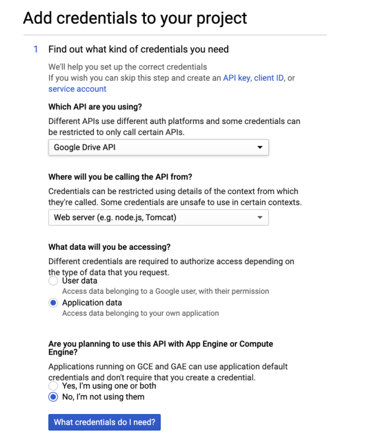
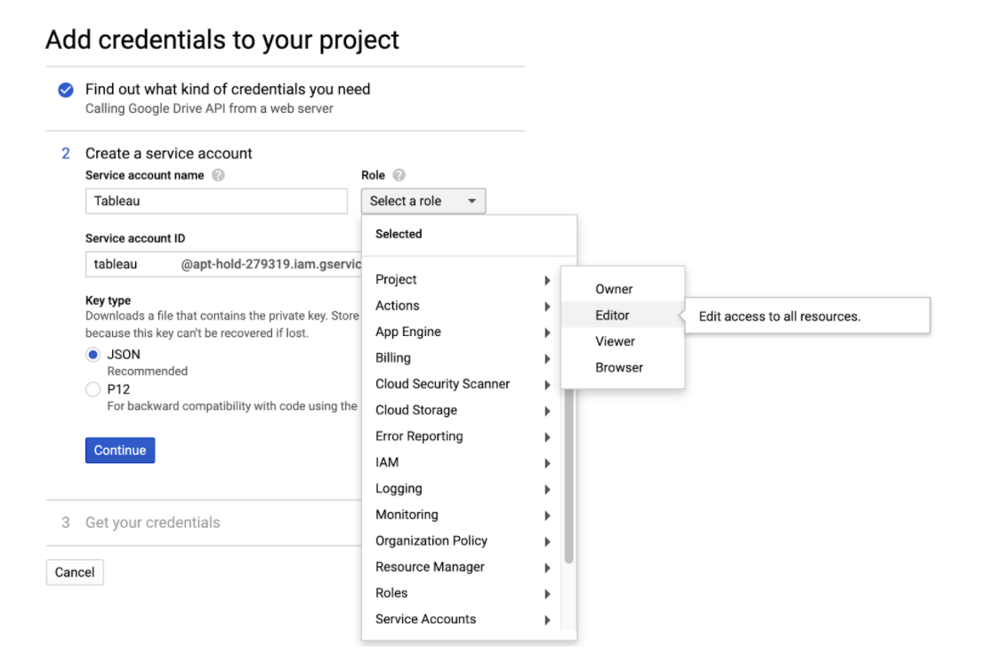
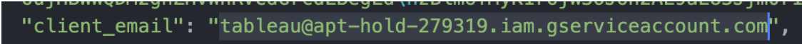

```{r echo=FALSE}
htmltools::img(src = knitr::image_uri(file.path('Analytica Logo.jpg')), 
               alt = 'logo', 
               style = 'position:absolute; top:0; right:0; padding:10px;width:150px')
```

## Purpose
The purpose of this document is to develop a pipeline to automatically refresh a Tableau Public document more than once every 24 hours. Using this methodology, you can refresh Tableau at whatever schedule is required. This is important because Tableau Public currently updates the Google Sheet connection to a dashboard only once per day, which is severely limiting for time-sensitive analytics.

## Pipeline Overview:
There are essentially three main steps to implementing this solution:

1. Connect the Tableau dashboard to Google Sheets, which will be controlled using the gpsread API in python.
2. Use Selenium, a package that can control a web browser, to refresh the Google Sheets data connection.
3. Schedule the python script to run at whatever time or interval is required.


## Pipeline Steps:
### Step 1: Configure gspread API in python
Create a Google Sheet, or multiple Google Sheets if required, that will contain the data to be presented in the Tableau Public dashboard. Make sure that these Google Sheets are connected to the Tableau Dashboard. Then, follow the instructions in this YouTube video to setup the gspread API, which will allow you modify the Google Sheet using python:
https://www.youtube.com/watch?v=vISRn5qFrkM.

I will highlight the steps in the video here. There are some important modifications, so it is recommended to follow the steps below.

1. Navigate to https://console.developers.google.com/ and create a new project.
2. Then, click on “Library”, add the Google Drive API and select “Enable”.
3. Next, click on “CREATE CREDENTIALS” in the upper right hand corner and complete them like the following screenshot, then click “What credentials do I need?” at the bottom.
<div>

</div>
4. Then, create a service account and name it whatever you would like. Change "Role" to "Project" >> "Editor". Keep JSON selected as Key type. Then select “Continue”. This creates a google account that can be manipulated using the API. Use the following screenshot for guidance.
<div>

</div>
5. This will download a JSON file to your computer. Open the JSON file in a text editor like Notepad++, Sublime, Atom, etc. and copy the “client_email” address like the following screenshot. Move this JSON file to your project directory.
<div>

</div>
6. Now, open the Google Sheet (or multiple Google Sheets) you have created, and click “Share” in the top right corner. Paste in the email you just copied, and share the Google Sheet.
7. Now, create a python script in your project directory. Write the following lines of code. 
```{python eval=FALSE, include=TRUE, python.reticulate=FALSE}
import gspread
from oauth2client.service_account import ServiceAccountCredentials

scope = ['https://www.googleapis.com/auth/drive']
creds = ServiceAccountCredentials.from_json_keyfile_name('Test-9176086fefeb.json',scope)
client = gspread.authorize(creds)

sheet = client.open('Test').sheet1

records = sheet.get_all_records()
print(records)
```
8. Now, run this python script from your terminal. You may need to install gspread and oauth2client first using **pip install**, **pip2 install**, or **pip3 install**, depending on your python version. Additionally, if you receive an error message, it will contain a URL. Copy that URL and paste it in your browser. This will give the service account you created access to the Google Sheets API, as well as the Google Drive API you already set up. Then, run the python script again and it should print out whatever you have in the Google Sheet. 
9. Now you are connected and ready to manipulate Google Sheets with python. Please read the following documentation for methods and functions you can use in the gspread API: https://gspread.readthedocs.io/en/latest/.
You can add rows, update cells, delete cells, and interact with Google Sheets how you normally would, but through a python script.

### Step 2: Setting up Selenium
1. Install Chromedriver here: https://chromedriver.chromium.org/downloads. Choose the correct download for the version of chrome you are running.
2. Move the chromedriver out of your downloads folder and into your project directory.
3. In the terminal, install selenium. I used ***pip3 install selenium***, but you may have to install it a different way depending on what version of python you are running.
4. *Copy and paste the following code into your python script*. This script opens up chrome, logs into tableau, opens up the correct dashboard, scrolls to the bottom and refreshes the Google Sheet connection, and then refreshes the page. You will need to fill in your Tableau Public username and password. Additionally, you will need to link to the correct URL where the tableau workbook is that is connected to your Google Sheet. You might need to change the xpaths and IDs to those that are relevant to your dashboard. There are plenty of tutorials on how to use selenium. 
```{python eval=FALSE, include=TRUE, python.reticulate=FALSE}
chrome_options = webdriver.ChromeOptions()
chrome_options.add_argument('--no-sandbox')
driver = webdriver.Chrome(options=chrome_options)


driver.get("https://public.tableau.com/en-us/s/")
time.sleep(4)
driver.find_elements_by_xpath('//*[@id="block-menu-block-1"]/div/ul/li[7]/a')[0].click()

user = '***@****.com' # INPUT Tableau Username
user_sign_in = driver.find_elements_by_id('login-email')[0]
user_sign_in.send_keys(user)

pword = '*********' # INPUT Tableau Password
pword_sign_in = driver.find_elements_by_id('login-password')[0]
pword_sign_in.send_keys(pword)

driver.find_element_by_id('signin-submit').click()
time.sleep(4)

driver.get('*********') # INPUT URL to Tableau Dashboard
time.sleep(4)
driver.refresh()
time.sleep(4)

driver.execute_script("window.scrollTo(0, document.body.scrollHeight);")
time.sleep(4)

driver.find_element_by_xpath('//*[@id="ng-app"]/body/div[1]/div[2]/section/div/div[2]/section[3]/div/figcaption/div[2]/div/div/div[2]/dl/div[1]/dd/button').click()
driver.refresh()
time.sleep(4)
driver.refresh()
time.sleep(4)
driver.quit()
```

### Step 3: Scheduling 
You can then schedule your python script to run at intervals or at specific time using native tools, like Microsoft Task Scheduler or Apple Automator, but these options are relatively weighty to implement. Instead, I opted to use a python package called schedule. Documentation found here: https://pypi.org/project/schedule/. 

Additionally, hosting your python script on the cloud (like AWS or Google Cloud) provides security, redundancy, and scalability that may be useful.


### Use Cases
By implementing the solution above, you now have the power to use Google Sheets as a *de facto* data lake. By intelligently structuring the data in the Google Sheets you can create a free, albeit small-scale, SQL database alternative. This provides many methods to source and ETL data using python (like BeautifulSoup for web scraping and Pandas for data wrangling/cleaning) and then create automatic data reloads to Tableau. 

#### Disclaimer
Note, it is not *exactly* a SQL alternative because it does not provide the same keying and datatype capabilities. Additionally, you are subject to Google Sheet size constraints (https://support.google.com/drive/answer/37603). This is *not* intended to be a solution for archiving large amounts of data; this is intended to provide a small-scale database solution to automate Tableau.

### Possible Improvements
One drawback of this approach is that it requires a Google Chrome GUI to be controlled by the Selenium bot. This precludes using server-less cloud hosting tools like AWS Lambda. Instead, one would need to deploy an EC2 instance, which is both more time-intensive and expensive. One avenue that needs to be addressed is possibly making the Selenium bot run on a "headless" browser, effectively removing the requirement of using the Google Chrome GUI, therefore making AWS Lambda a workable option for cloud hosting.